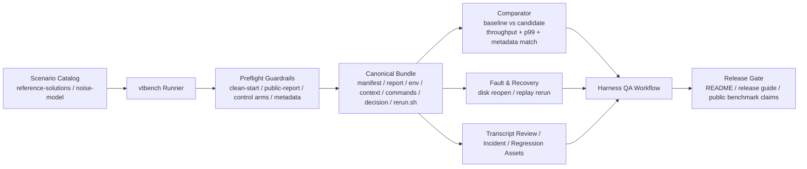
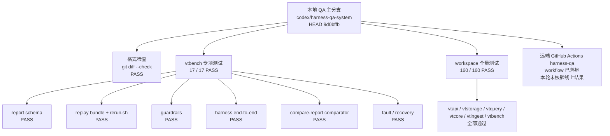

# QA System Overview

> `rust_victoria_trace` Harness QA 系统总览
>
> 这份文档回答两个问题：
>
> - 这套 QA 系统由哪些层组成
> - 最近一次本地完整运行的结果是什么

## 1. QA 系统结构图



## 2. 主要组件

### Scenario Catalog

定义哪些 benchmark 场景是正式 QA 资产，而不是一次性的临时命令。

当前入口：

- [Benchmark QA Catalog](/Users/sen.chai/.config/superpowers/worktrees/rust_victoria_trace/codex-harness-qa-system/docs/benchmarks/README.md)
- [Noise Model](/Users/sen.chai/.config/superpowers/worktrees/rust_victoria_trace/codex-harness-qa-system/docs/benchmarks/noise-model.md)
- [Reference Solutions](/Users/sen.chai/.config/superpowers/worktrees/rust_victoria_trace/codex-harness-qa-system/docs/benchmarks/reference-solutions/README.md)

### vtbench Runner

`vtbench` 现在不只是跑 benchmark，还承担 QA harness 的执行入口。

当前关键代码：

- [main.rs](/Users/sen.chai/.config/superpowers/worktrees/rust_victoria_trace/codex-harness-qa-system/crates/vtbench/src/main.rs)
- [report.rs](/Users/sen.chai/.config/superpowers/worktrees/rust_victoria_trace/codex-harness-qa-system/crates/vtbench/src/report.rs)
- [replay.rs](/Users/sen.chai/.config/superpowers/worktrees/rust_victoria_trace/codex-harness-qa-system/crates/vtbench/src/replay.rs)
- [compare.rs](/Users/sen.chai/.config/superpowers/worktrees/rust_victoria_trace/codex-harness-qa-system/crates/vtbench/src/compare.rs)

### Preflight Guardrails

负责拦截不合法或不公平的 benchmark 声明。

当前已经覆盖：

- disk clean-start 非空目录拦截
- public benchmark 缺失 `official/memory/disk` control arms 拦截
- benchmark metadata 必填项检查

### Canonical Bundle

每次 run 都能沉淀为统一证据模型，而不是只有 stdout。

当前 bundle 结构：

- `manifest.json`
- `report.json`
- `env.json`
- `context.json`
- `commands.json`
- `decision.json`
- `stdout.log`
- `stderr.log`
- `metrics.txt`
- `rerun.sh`

### Comparator

支持 baseline vs candidate 的机械化比较。

当前比较维度：

- metadata exact match
- throughput regression tolerance
- p99 regression tolerance
- replay ID aware compare output

### Fault & Recovery

支持验证 benchmark 失败或磁盘持久化之后，系统能否恢复和回放。

当前覆盖：

- disk run 后 reopen 验证
- replay bundle 的 `rerun.sh` 自举重跑

### Transcript / Incident / Regression Assets

把可疑 run 和 release-facing run 变成正式 QA 资产。

当前模板：

- [Transcript Review Template](/Users/sen.chai/.config/superpowers/worktrees/rust_victoria_trace/codex-harness-qa-system/docs/benchmarks/transcript-review-template.md)
- [Incident Template](/Users/sen.chai/.config/superpowers/worktrees/rust_victoria_trace/codex-harness-qa-system/docs/benchmarks/incident-template.md)
- [Regression Template](/Users/sen.chai/.config/superpowers/worktrees/rust_victoria_trace/codex-harness-qa-system/docs/benchmarks/regression-template.md)
- [Incident To Eval Loop](/Users/sen.chai/.config/superpowers/worktrees/rust_victoria_trace/codex-harness-qa-system/docs/benchmarks/incident-to-eval.md)

### Workflow / Release Gate

当前已经拆成两个 GitHub Actions 入口：

- [harness-qa.yml](/Users/sen.chai/.config/superpowers/worktrees/rust_victoria_trace/codex-harness-qa-system/.github/workflows/harness-qa.yml)
- [linux-release.yml](/Users/sen.chai/.config/superpowers/worktrees/rust_victoria_trace/codex-harness-qa-system/.github/workflows/linux-release.yml)

对应的对外发布说明已接到：

- [README.md](/Users/sen.chai/.config/superpowers/worktrees/rust_victoria_trace/codex-harness-qa-system/README.md)
- [Production Release Guide](/Users/sen.chai/.config/superpowers/worktrees/rust_victoria_trace/codex-harness-qa-system/docs/production-release-guide.md)

## 3. 本轮运行结果图



## 4. 本轮实际验证结果

本轮 fresh 跑过的本地命令：

```bash
git diff --check
cargo test -p vtbench -- --nocapture
cargo test --workspace -- --nocapture
```

结果：

- `git diff --check`: `PASS`
- `cargo test -p vtbench -- --nocapture`: `PASS`
- `cargo test --workspace -- --nocapture`: `PASS`
- `vtbench` 新增专项测试：`17/17 PASS`
- workspace 总测试：`160/160 PASS`

## 5. 当前已经被 QA 覆盖到的能力

- canonical run bundle
- replayable `rerun.sh`
- clean-start disk guardrail
- public benchmark control-arm guardrail
- baseline vs candidate comparator
- disk reopen 和 fault / recovery 回放验证
- incident / transcript / regression 资产模板
- 独立 harness QA workflow

## 6. 当前边界

这份结果只代表：

- 本地 QA 已经跑通
- 当前分支代码与文档是一致的
- 这套 QA 系统已经可以作为项目后续测试主线使用

这份结果暂时还不代表：

- 远端 GitHub Actions `harness-qa` 已经核验通过
- 所有 nightly matrix 都已经实际跑过
- 所有 public benchmark 场景都已经灌满 baseline

## 7. 推荐使用方式

后续任何性能优化、回归调查或 release 准备，建议统一走这条链路：

1. 用 `vtbench` 生成 canonical bundle
2. 用 `compare-report` 与 baseline 对比
3. 如有异常，创建 transcript review 和 incident
4. 将确认过的问题沉淀为 regression asset
5. 让 `harness-qa` workflow 成为 merge/release 的常驻质量门
