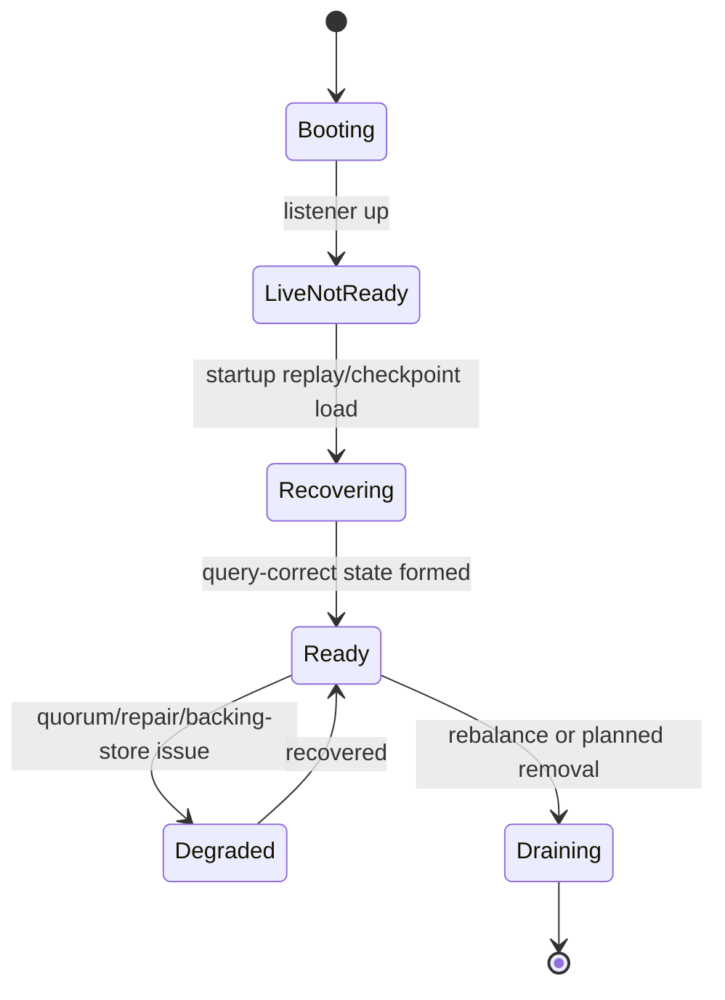

# HA、恢复与一致性细化设计

> 本文是
> [2026-04-08-victoriatraces-design-realignment.md](/Users/sen.chai/wmt_shop_env_projects/codex_projects/opentelemetry-migrate/rust_victoria_trace/docs/plans/2026-04-08-victoriatraces-design-realignment.md)
> 的第四份细化文档，专门定义我们相对于 VictoriaTraces 应当保留并强化的高可用、恢复、一致性语义。

## 1. 目标

这份设计要回答两个问题：

1. 哪些 HA / readiness / recovery 能力是 Rust 版本的真实产品优势，不能为了追 benchmark 而丢掉。
2. 这些能力怎样与更轻的 data plane 兼容，而不是互相拖累。

目标很明确：

1. 保留严格的 `livez` / `readyz` 分层。
2. 保留 write quorum / read quorum / read repair / rebalance / topology-aware placement。
3. 让 recovery v2 成为可靠的启动加速结构，但不成为可用性依赖。
4. 把“强语义”与“轻数据面”明确解耦。

## 2. 与 VictoriaTraces 的分工差异

VictoriaTraces 在 data plane 上更轻，但它并没有内建我们现在这套更强的 HA 语义：

1. 没有完整的复制协议。
2. 没有 write quorum / read quorum。
3. 没有 read repair。
4. HA 更多依赖外部体系。

Rust 版本已经做出的价值，是在存储系统内部给出了：

1. 更清晰的角色边界
2. 更强的集群可用性语义
3. 更强的恢复与运维可观测性

所以这份设计的重点不是向 upstream 学 HA，而是明确哪些东西必须继续保留。

## 3. 角色与边界

### 3.1 `insert`

职责：

1. 接收写入流量。
2. 做 auth / limits / decode / shard routing。
3. 负责 write quorum 协调。

### 3.2 `storage`

职责：

1. 本地 durable append。
2. 本地 query execution。
3. 后台 materialize / merge / checkpoint。
4. 向 cluster 暴露 readiness 和本地健康状态。

### 3.3 `select`

职责：

1. 查询入口。
2. fan-out / fan-in。
3. read quorum 和读修复判定。

这三个角色边界是当前系统正确性和安全边界的重要组成部分，不应回退到更模糊的单体职责。

## 4. Readiness 语义

### 4.1 `livez`

`livez=200` 只表示：

1. 进程已经启动。
2. HTTP/TCP 服务已监听。
3. 基本事件循环和关键线程可工作。

它不表示：

1. 本地数据已经恢复完成。
2. 查询结果已经完整正确。
3. 节点已经可以加入读写流量。

### 4.2 `readyz`

`readyz=200` 必须继续保持强语义：

1. 本地 persisted state 已经恢复到查询正确状态。
2. head + sealed state 已完成可服务流量的最小拼装。
3. 节点已经可以承担角色对应的真实业务流量。

禁止引入：

1. “先 ready，部分查询退化”的灰区语义。
2. “只能写不能读”但仍然对外宣称 ready 的混合状态。

### 4.3 状态信息

除了 HTTP probe，系统还应持续暴露结构化状态：

1. `storage listening on ...`
2. `storage recovery in progress`
3. `storage checkpoint invalid; rebuilding from segments`
4. `storage ready on ...`

这类状态对生产运维非常关键，应继续保留。

## 5. Write Quorum 语义

### 5.1 写入成功定义

写入请求成功，必须满足：

1. 请求已经被路由到目标副本集合。
2. 至少达到配置的 write quorum。
3. quorum 中的副本已经跨过其 durability 边界。

durability 边界取决于 `sync policy`，但 quorum 语义本身不变。

### 5.2 副本确认不一致

如果部分副本成功、部分失败：

1. 当成功副本数达到 quorum，整体请求可返回成功。
2. 失败副本的补齐由后续 repair / rebalance 体系承担。
3. 必须记录“部分副本失败但 quorum 成功”的统计与日志。

### 5.3 拒绝的简化

为了 benchmark 追分，不应引入：

1. “只要本地 append 成功就算成功”的伪复制模式。
2. “先返回成功，再异步决定是否满足 quorum”的模糊模式。

## 6. Read Quorum 与 Read Repair

### 6.1 读成功定义

查询成功，必须满足：

1. 访问了足够的副本以形成 read quorum。
2. 返回结果经过一致性校验与 merge。

### 6.2 Read Repair 触发条件

只有在以下情况下触发 repair：

1. quorum mismatch
2. 副本缺失
3. 明确的数据版本冲突

平稳查询不应默认执行 repair，也不应把 repair 变成必经阻塞阶段。

### 6.3 结果优先原则

在满足 read quorum 的情况下：

1. 优先返回正确结果。
2. repair 以后台补偿为主。
3. repair 的耗时和普通查询耗时分开统计。

## 7. Rebalance 与 Topology-aware Placement

### 7.1 Placement

Placement 需要继续考虑：

1. shard ownership
2. replica spread
3. topology boundary
4. failure domain

这样单机、单机架或单可用区故障时，系统仍有更高概率维持 quorum。

### 7.2 Rebalance

Rebalance 应该持续作为后台控制面能力，而不是人为运维动作。它负责：

1. 节点增减后的 ownership 重分布。
2. 数据副本再平衡。
3. 节点长期倾斜修正。

### 7.3 与 data plane 的边界

Rebalance 不应污染 steady-state ingest hot path。更具体地说：

1. ingest path 只接受“当前 placement 结果”。
2. ownership 迁移在后台推进。
3. 查询层只感知最终一致的路由视图。

## 8. Recovery v2 语义

### 8.1 Recovery Checkpoint 的角色

recovery v2 的定位必须固定为：

1. 启动加速结构
2. shard-state checkpoint
3. covered segment set 记录器

它不是：

1. source of truth
2. 唯一可用性依赖
3. 通用查询索引

### 8.2 `kind=wal|part`

为了让 recovery v2 与更轻的数据平面兼容，manifest 必须支持：

1. covered object id
2. covered object kind = `wal` 或 `part`
3. shard-state payload checksum
4. format version

只有这样，系统才能既保留 recovery 加速，又允许 steady-state 回到 rotate-only ingestion。

### 8.3 Soft-fail 原则

以下任何异常都不应让系统直接不可用：

1. manifest 损坏
2. shard checkpoint 损坏
3. covered object 缺失

行为应统一为：

1. 标记 checkpoint invalid
2. 回退到 segment recovery
3. 维持 `livez=200`
4. 在恢复完成前保持 `readyz=503`

## 9. 崩溃恢复与一致性边界

### 9.1 崩溃后保证什么

系统至少保证：

1. quorum-success 的写入，在满足其 durability policy 的副本上是可恢复的。
2. startup 完成后，ready 的节点能提供完整正确查询。
3. recovery acceleration 失败不会破坏正确性，只会影响恢复耗时。

### 9.2 不保证什么

系统不保证：

1. `sync=none` 下崩溃后尾部数据零丢失。
2. 所有副本始终完全同步。
3. repair 尚未执行完时所有副本都立刻一致。

这些边界必须写清楚，避免“更强 HA”被误解成“所有模式下都强同步”。

## 10. 节点状态机

建议把 storage 节点状态显式化：

这样控制面和运维才能更明确地理解节点行为，而不是只靠日志猜状态。

## 11. 关键指标

必须持续暴露：

1. `vt_cluster_write_quorum_success_total`
2. `vt_cluster_write_partial_replica_failure_total`
3. `vt_cluster_read_quorum_success_total`
4. `vt_cluster_read_repair_triggers_total`
5. `vt_cluster_rebalance_moves_total`
6. `vt_storage_startup_ready`
7. `vt_storage_startup_failed`
8. `vt_storage_recovery_checkpoint_valid`
9. `vt_storage_recovery_checkpoint_fallback_total`
10. `vt_storage_node_state`

### 11.1 成本模型

本节沿用
[2026-04-09-storage-cost-model-framework.md](/Users/sen.chai/wmt_shop_env_projects/codex_projects/opentelemetry-migrate/rust_victoria_trace/docs/plans/2026-04-09-storage-cost-model-framework.md)
里的统一口径，但 HA 层需要单独记账以下成本：

1. `NetAmp_replication = replica_network_bytes / logical_bytes`
2. `QuorumLatencyAmp = latency_at_quorum / latency_fastest_replica`
3. `RepairDebt = pending_repair_bytes / steady_state_ingest_bytes_per_second`
4. `RebalanceBudget = rebalance_bandwidth / foreground_bandwidth`
5. `RecoveryFallbackRate = checkpoint_fallback_starts / total_starts`

这五个系数的意义是：

1. HA 不是“免费能力”，它一定会带来网络、延迟和后台债务。
2. 顶流设计不是消灭这些成本，而是把它们隔离、限幅、可观测。

### 11.2 顶流预算

1. `NetAmp_replication`
   目标：接近复制因子带来的理论下界，不额外引入无意义重传。
2. `QuorumLatencyAmp`
   目标：成功路径更接近“第 k 个副本确认”，而不是退化成“等所有副本”。
3. `RepairDebt`
   目标：健康集群长期维持低位，不能让 repair 成为常态背景流量。
4. `RebalanceBudget`
   目标：默认受控，不抢占前台主要吞吐。
5. `RecoveryFallbackRate`
   目标：极低且可解释。
   说明：warm restart 应主要依赖 checkpoint + uncovered tail，而不是频繁回退全量 recovery。

## 12. 故障演练要求

这部分不能只停留在设计上，必须配套 fault drill：

1. checkpoint 损坏启动
2. 部分副本丢失写入确认
3. read quorum 不一致
4. rebalance 中节点下线
5. `sync=none` / `sync=batch` / `sync=always` 三档下的崩溃恢复

这些演练应该由 `vtbench` 或对应集成测试接入，而不是靠手工验证。

## 13. 与 VictoriaTraces 的对比结论

如果只看 raw ingest throughput，VictoriaTraces 目前更强；但如果看系统语义，Rust 版本已经在这些点上形成了更高上限：

1. readiness 更严格
2. cluster 更完整
3. quorum / repair / rebalance 更完整
4. 恢复语义更明确

所以正确方向不是“为了追 official，把这些都拆掉”，而是：

1. 保留这套高可用能力
2. 用更轻的 data plane 把 steady-state 性能追回来

## 14. 明确拒绝的方向

1. 不把 `readyz` 降级成“部分可用”探针。
2. 不让 recovery checkpoint 成为硬依赖。
3. 不为了追 benchmark 取消 quorum / repair / rebalance。
4. 不把 topology-aware placement 简化成随机副本分布。

## 15. 实施顺序建议

1. 先扩 recovery v2 支持 `kind=wal|part`。
2. 再把 rotate-only ingestion 与 current HA 语义对齐。
3. 然后补齐 fault drills 与 cluster metrics。
4. 最后再评估是否需要进一步收紧或扩展一致性策略。

这样可以保证 data plane 优化与 HA 语义演进是兼容的，而不是互相踩踏。
