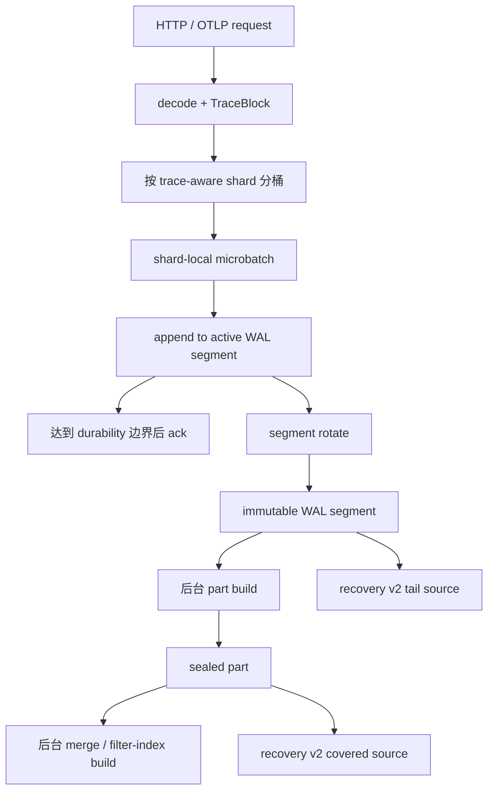
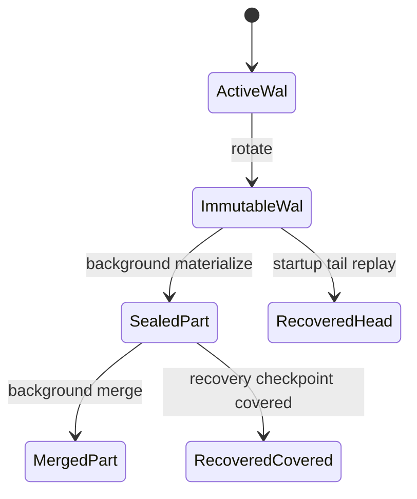

# 写入与持久化细化设计

> 本文是
> [2026-04-08-victoriatraces-design-realignment.md](/Users/sen.chai/wmt_shop_env_projects/codex_projects/opentelemetry-migrate/rust_victoria_trace/docs/plans/2026-04-08-victoriatraces-design-realignment.md)
> 的第一份细化文档，专门回答四个问题：写入热路径该多轻、数据什么时候 ack、持久化状态怎样流转、后台布局优化该由谁承担。

## 1. 目标

这份设计的目标不是简单“把当前 Rust 写路径修快一点”，而是把写入与持久化重新拉回到一个更成熟的存储模型：

1. `ack path` 只做最小必要的接收、分片、批量、顺序追加和 durability 边界确认。
2. `seal / flush / merge / 索引构建 / checkpoint` 统一移出同步写路径。
3. 保留 Rust 版本已经形成的强 readiness、recovery v2 和 cluster 语义。
4. 让 steady-state ingest 再次具备稳定超过 official 的机会。

## 2. 当前问题总结

结合 benchmark、profiling 和 recent A/B，对当前写路径的判断已经比较清楚：

1. 当前回退的主因不是 recovery v2 本身，而是 steady-state data plane 太重。
2. 热点首先是 combiner 竞争与 WAL write syscall，而不是编码格式本身。
3. 当前 segment 达阈值后的 snapshot + seal 语义，把“未来查询怎么加速”的工作提前压到了 ingest ack path 周边。
4. 当前 row-oriented WAL payload 既承担短期 durability，又承担过多长期 canonical storage 职责，导致演进空间被锁死。

这意味着下一版设计不应该继续在热路径上加功能，而应该先做职责削减。

## 3. 设计原则

### 3.1 先接收写入，再做布局优化

写入路径的第一职责是以尽量低的抖动接收数据，不是立刻把数据改造成长期最优查询布局。长期布局优化应该由后台阶段承担。

### 3.2 durability 与 query acceleration 解耦

被确认写入的数据，必须已经跨过明确的 durability 边界；但它不需要在同一个时刻完成长期查询索引、part 化和 merge。

### 3.3 canonical storage 分层

新的持久化模型应该明确分成 4 层：

1. `active WAL segment`
   同步写入承载层。
2. `immutable WAL segment`
   旋转后的只读持久化层，也是恢复与后台物化的输入。
3. `sealed part`
   面向查询的长期存储层。
4. `recovery checkpoint v2`
   启动加速层，不是 canonical source of truth。

### 3.4 写路径只保留最小同步索引

同步写入路径只保留 trace-by-id 真正需要的最小 head 结构，不再同步维护更重的 search/list/tag 加速结构。

## 4. 目标写入架构

整体数据流应该收敛为：

### 4.1 请求线程负责什么

请求线程只负责：

1. decode 和 schema/limits/auth 校验。
2. 构造 `TraceBlock`。
3. 按 shard 分桶。
4. 进入 shard-local microbatch。
5. 等待 shard append 结果。

请求线程不再负责：

1. part seal
2. 查询索引物化
3. merge
4. recovery checkpoint 重写

### 4.2 shard-local microbatch

`TraceBlock` 的物理 ingest 单元应从“每个请求一个小块”升级为“每个 shard 一个 microbatch”。这条路线已经在
[2026-04-06-trace-microbatch-design.md](/Users/sen.chai/wmt_shop_env_projects/codex_projects/opentelemetry-migrate/rust_victoria_trace/docs/plans/2026-04-06-trace-microbatch-design.md)
里提出，这里把它正式纳入 canonical 写路径设计。

每个 shard 维护一个本地 batch worker，按以下门限 flush：

1. `max_batch_rows`
2. `max_trace_batch_blocks`
3. `max_batch_wait`
4. `segment remaining bytes`

设计要求：

1. batch worker 必须是 shard-local 的，不引入 disk-engine 内更深一层 async merge worker。
2. batch worker 输出给 engine 的是更少、更大的物理 append 单元。
3. request 语义仍然保持同步确认，不引入“请求先返回、后台实际 append”这种新不确定性。

### 4.3 active WAL append

engine 侧对 batch 的同步职责只剩下：

1. 准备 WAL batch header / checksum
2. 追加写 active WAL segment
3. 更新最小 head trace-by-id 状态
4. 在达到所选 durability 边界后返回成功

这里最关键的一条是：

`segment rotate` 只能是便宜的 rotate，不能在热路径上自动升级成昂贵的 snapshot + seal。

## 5. 持久化状态机

### 5.1 segment 生命周期

### 5.2 四种持久化对象

#### A. Active WAL Segment

职责：

1. 承担顺序追加写。
2. 作为 request ack 的 durability 边界。
3. 持有当前还在增长的 segment payload。

约束：

1. 只允许一个 writer。
2. 不允许并发 seal。
3. 只在 rotate 时关闭。

#### B. Immutable WAL Segment

职责：

1. 作为 background materialize 的输入。
2. 作为 recovery tail replay 的输入。
3. 在 part 尚未生成前，仍然是合法持久化来源。

这是当前设计最重要的调整点。它让系统可以在不把 seal 放进热路径的情况下，仍然拥有明确 durability。

#### C. Sealed Part

职责：

1. 成为长期查询的主要数据源。
2. 承载更适合查询的 block-native 编码。
3. 成为 filter/index sidecar 的挂载对象。

#### D. Recovery Checkpoint v2

职责：

1. 加速启动。
2. 记录哪些 segment 已被覆盖。
3. 让 startup 只回放 uncovered tail。

约束：

1. 它不是 source of truth。
2. 任何损坏都应该 soft-fail，并回退到 segment recovery。
3. manifest 必须理解 covered object 的 `kind=wal|part`。

## 6. Durability 模型

这份设计建议明确支持三档 durability 策略：

### 6.1 `sync=always`

每个 batch append 后都完成明确的 fsync 或等价 durable flush，再返回成功。

适用：

1. 最强正确性要求
2. 较低吞吐环境

### 6.2 `sync=batch`

多个 append 共享一次 group commit epoch，再统一 durable flush。

适用：

1. 默认生产策略
2. 在可接受极短时间窗风险前提下换更高吞吐

### 6.3 `sync=none`

只保证写入进入进程缓冲和 OS 缓冲，不在每个 batch 上等待 durable flush。

适用：

1. benchmark
2. 明确接受崩溃丢尾部数据的环境

设计要求：

1. benchmark 报告必须显式记录当前 durability 档位。
2. readiness 与 durability 档位不能混淆。
3. `sync=none` 下必须避免每次 append 立刻 flush BufWriter，否则会白白吃掉 syscall 成本。

## 7. 后台 materialize / seal / merge 体系

### 7.1 背景任务职责

后台阶段统一承担以下工作：

1. 从 immutable WAL segment 物化 sealed part。
2. 为 sealed part 构建持久化过滤索引。
3. 合并小 part 成大 part。
4. 在安全时机重写 recovery checkpoint v2。

### 7.2 与写路径的关系

后台任务必须满足两个约束：

1. 不抢占 request ack path 上的关键锁和关键线程。
2. 即便后台落后，steady-state ingest 也应继续稳定。

这意味着：

1. 后台允许积压，但积压必须可观测。
2. 当积压过大时，可以降级 part materialize 的速度或推迟 merge，但不能让 ingest 线程为此阻塞。

### 7.3 sealed candidate 策略

rotate 后的 immutable WAL segment 立刻变成 sealed candidate，但不要求立刻变成 part。

换句话说，`sealed candidate != sealed part`。

这个区分很重要，它是 VictoriaTraces 那种“先写入，再后台布局优化”模型在 Rust 侧的等价物。

## 8. 性能目标

写入与持久化设计的目标不是只优化一两个局部 hotspot，而是给 steady-state data plane 定一个清晰的性能边界。

### 8.1 热路径目标

1. `combiner contention` 不再成为第一大瓶颈。
2. `write()` syscall 次数显著下降。
3. segment rotate 只产生便宜的 writer 切换和元数据更新。
4. seal / part build 不再占用请求关键路径。

### 8.2 基准目标

在同口径 native benchmark 下：

1. disk ingest 要重新回到不低于 official 的轨道。
2. `p99` 不得因为后台 materialize 产生长尾抖动。
3. `sync=none`、`sync=batch`、`sync=always` 需要分别保留基准结果。

### 8.3 关键指标

必须持续暴露：

1. `vt_storage_trace_batch_queue_depth`
2. `vt_storage_trace_batch_flushes_total`
3. `vt_storage_trace_batch_input_blocks_total`
4. `vt_storage_trace_batch_output_blocks_total`
5. `vt_storage_active_wal_segments`
6. `vt_storage_immutable_wal_segments`
7. `vt_storage_part_build_queue_depth`
8. `vt_storage_merge_queue_depth`
9. `vt_storage_recovery_checkpoint_age_seconds`
10. `vt_storage_write_fsync_operations_total`

### 8.4 成本模型

本节沿用
[2026-04-09-storage-cost-model-framework.md](/Users/sen.chai/wmt_shop_env_projects/codex_projects/opentelemetry-migrate/rust_victoria_trace/docs/plans/2026-04-09-storage-cost-model-framework.md)
里的统一口径，但把写入与持久化层的成本再收敛成下面五项：

1. `T_ack = T_decode + T_route + T_batch_wait + T_append_cpu + T_syscall + T_quorum`
2. `WA_durable = durable_bytes / logical_bytes`
3. `WA_layout = (part_build_bytes + merge_rewrite_bytes) / logical_bytes`
4. `WA_checkpoint = checkpoint_rewrite_bytes / logical_bytes`
5. `CoordAmp = waiting_time_on_combiner_or_batch / T_ack`

这里有两条原则必须固定：

1. `T_ack` 应主要由 batch append 和 durability 边界决定，不能被 seal、filter-index build、checkpoint rewrite 主导。
2. `WA_layout` 可以存在，但它应该是后台成本，不应该倒灌成前台延迟。

### 8.5 顶流预算

下面这些是设计预算，不是当前实测结果：

1. `WA_durable`
   单副本目标：`1.00x - 1.15x`
   说明：WAL 或等价 durable append 只能轻微高于逻辑字节数。
2. `WA_layout`
   长周期平均目标：`0.50x - 1.50x`
   说明：part build 和 merge 可以重写，但总重写量必须被预算约束。
3. `WA_checkpoint`
   长周期目标：`0.02x - 0.15x`
   说明：recovery acceleration 不能经常重写大体量状态。
4. `CoordAmp`
   稳态目标：`< 0.15`
   告警线：`> 0.30`
   说明：请求大部分时间不能消耗在等待 combiner 或批量队列。
5. `append_write_syscalls / logical_mib`
   目标：持续下降并与 batch 大小正相关。
   说明：如果 `sync=none` 下仍然呈现高 syscall 密度，说明 flush 策略错误。
6. `rotate_cost`
   目标：`O(1)` 元数据切换。
   说明：rotate 不应隐含 part seal、checkpoint rewrite 或昂贵查询索引构建。
7. `immutable_wal_backlog_seconds`
   目标：后台可持续清空，不能无界积压。
   说明：如果 immutable WAL 债务持续增长，说明后台 part build 预算已经失真。

## 9. 与 VictoriaTraces 的对比结论

这份设计并不是简单把 VictoriaTraces 的存储模型照搬过来，而是吸收它最值得学的几个点：

1. 写入接收和长期布局优化解耦。
2. 不把查询加速全部压进同步写路径。
3. 使用 immutable 层承担越来越多的长期职责。

同时保留我们自己的优势：

1. 更严格的 readiness 语义。
2. 更清楚的 durability 边界。
3. 更强的 cluster / quorum / repair 能力。

## 10. 明确拒绝的方向

1. 不回到“每个请求一个 tiny append 单元”的写入形态。
2. 不在热路径上继续扩大同步 head search/list 索引。
3. 不让 rotate 默认升级成热路径 seal。
4. 不让 recovery checkpoint 成为 availability dependency。

## 11. 实施顺序建议

1. 先扩 recovery v2 manifest，使其支持 `kind=wal|part`。
2. 恢复 rotate-only 的 steady-state segment 生命周期。
3. 落地 shard-local microbatch。
4. 减少 `sync=none` 下的无意义 flush。
5. 最后再推进 part-native 编码和后台 merge 优化。

这个顺序的原因很简单：先把结构边界立住，再调性能，才能避免“修一个热点，又把恢复语义打坏”的来回返工。
